<div align="center">
  <a href="https://resummme.asaa.dev">
    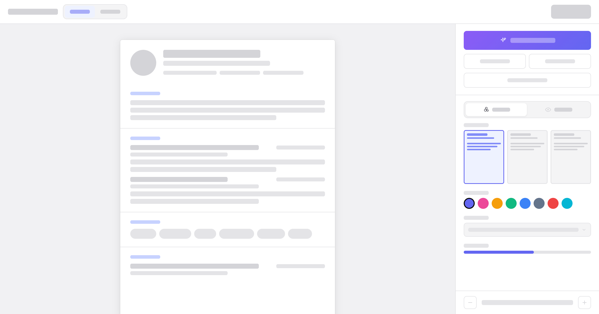
  </a>

  <h1>Resummme</h1>

  <p>Build a recruiter-ready resume in minutes. Write once, preview as you type, and export a clean PDF.</p>

  <p>
    <a href="https://resummme.asaa.dev"><strong>Live Demo</strong></a>
    ·
    <a href="https://github.com/angkasa27/resummme"><strong>GitHub Repo</strong></a>
  </p>

  <p>
    
    
    
  </p>
</div>

---

Resummme is a focused, fast resume editor designed to give you everything you need to craft your resume, with nothing that gets in your way. 

Built with privacy as a core principle, Resummme gives you complete ownership of your data. The codebase is fully open-source under the GNU Affero General Public License v3, with no tracking, no ads, and no paywalls. All your data stays in your browser and never leaves your machine unless you choose to use the AI or PDF export features.

## Features

**Resume Building**
- **Two ways to edit**: Drag and drop on the Canvas or fill in structured forms in the Classic editor. Same resume, your choice.
- **Instant live preview**: Every change renders immediately in a pixel-accurate preview, so what you see is exactly what you export.
- **Rich text editor**: Edit with formatting support powered by TipTap.
- **Import and export**: Bring in an existing resume to get started, or download/upload your resume data as portable JSON.

**Templates & Style Control**
- **11 professional templates**: Switch between eleven polished layouts (Classic, Sidebar, Modern Centered, Timeline, Academic, Minimal, Inset, Banner, Split, Tinted, Bold Type) without retyping a thing.
- **Typography**: Choose from Google Fonts and web-safe system fonts, with each option rendered in its own typeface in the font picker.
- **Design control**: Full control over accent color, font scale, line height, section spacing, paper size (A4 / Letter), and page margins.

**AI Assistance**
- **AI PDF extraction**: Upload an existing resume PDF and Gemini parses it directly into the editor fields.
- **AI writing assistant**: Improve any bullet point with AI; choose quick actions (stronger verb, add a metric, make it concise) or write custom instructions powered by Gemini.
- **ATS score**: Live structural/content scoring with feedback and keyword-gap analysis against any job description.

**Privacy & Security**
- **No account required**: Start building immediately. No registration, login, or passwords needed.
- **Private by default**: Your data is stored locally in the browser via `localStorage` and never leaves your device.

## Templates

<table>
  <tr>
    <td align="center">
      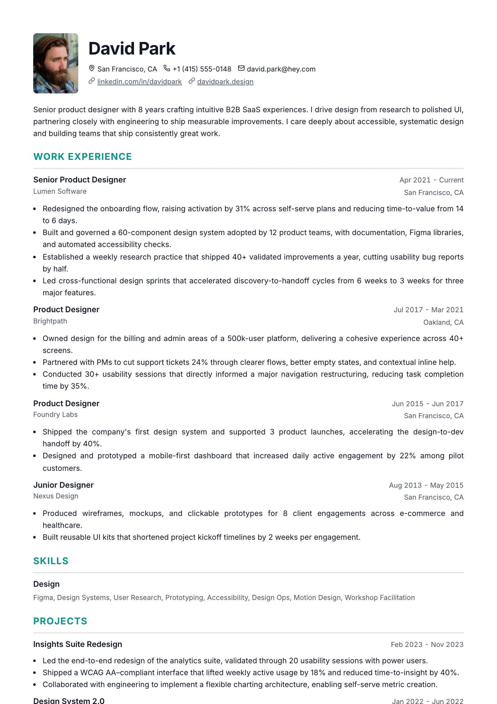
      <br /><sub><b>Classic</b></sub>
    </td>
    <td align="center">
      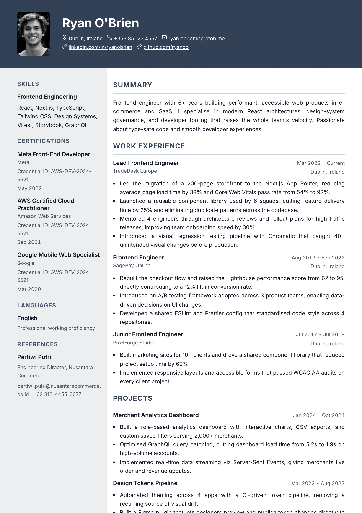
      <br /><sub><b>Sidebar</b></sub>
    </td>
    <td align="center">
      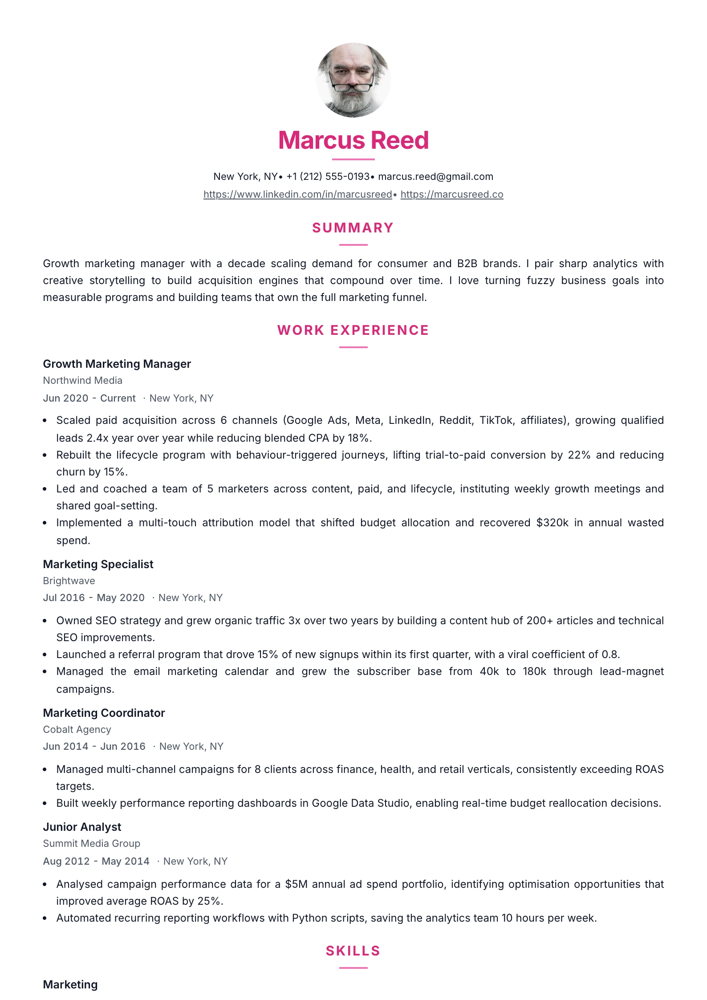
      <br /><sub><b>Modern Centered</b></sub>
    </td>
  </tr>
  <tr>
    <td align="center">
      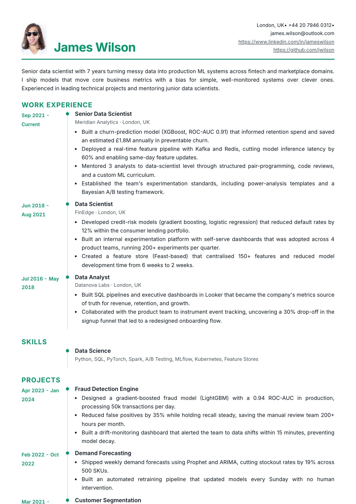
      <br /><sub><b>Timeline</b></sub>
    </td>
    <td align="center">
      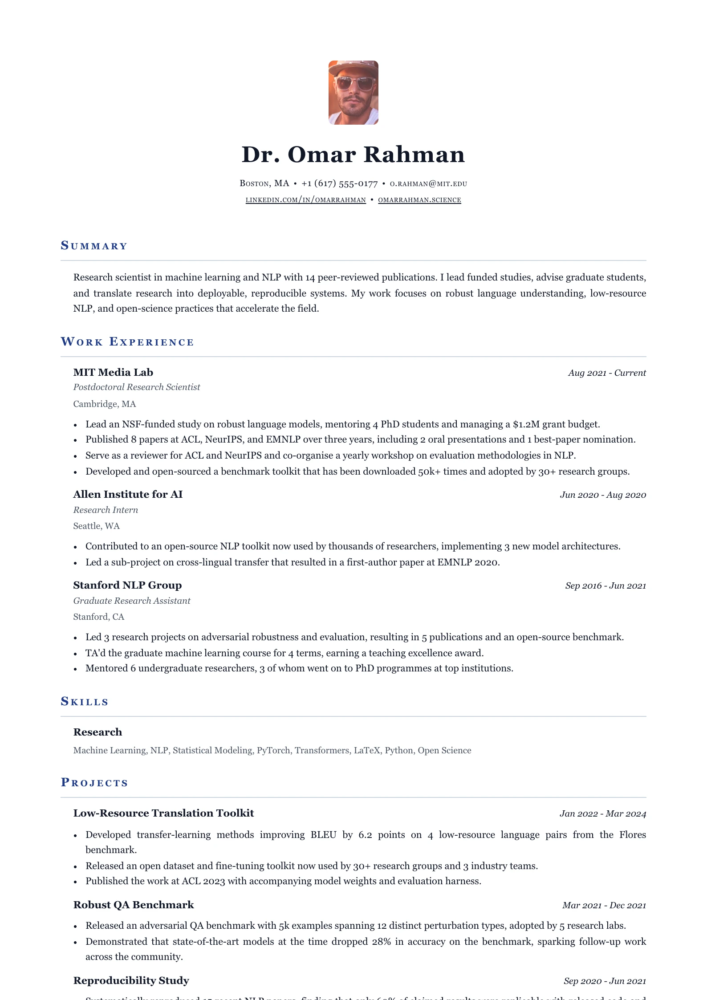
      <br /><sub><b>Academic</b></sub>
    </td>
    <td align="center">
      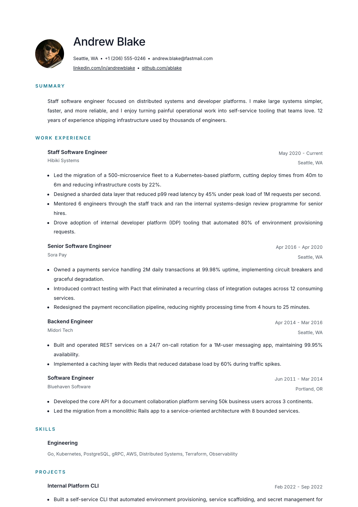
      <br /><sub><b>Minimal</b></sub>
    </td>
  </tr>
  <tr>
    <td align="center">
      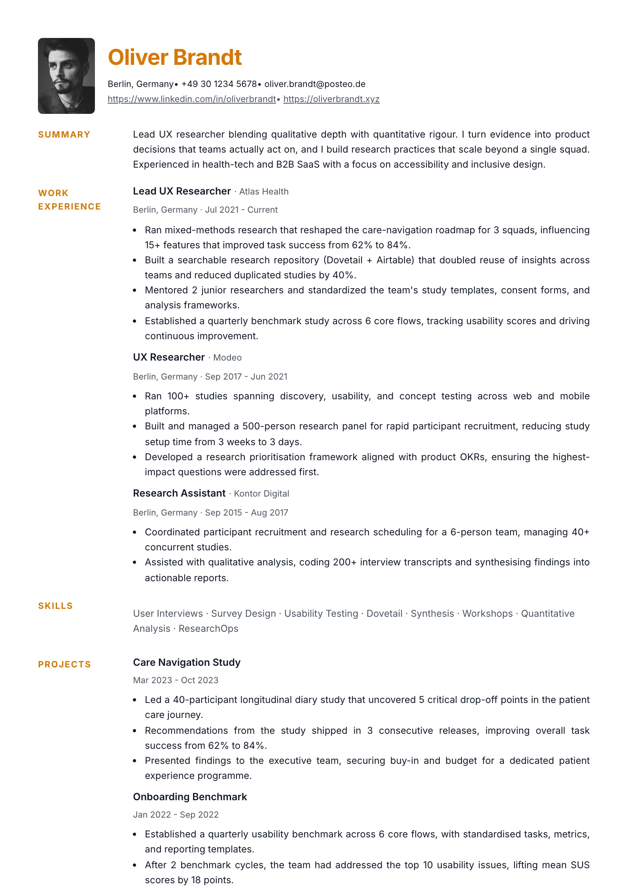
      <br /><sub><b>Inset</b></sub>
    </td>
    <td align="center">
      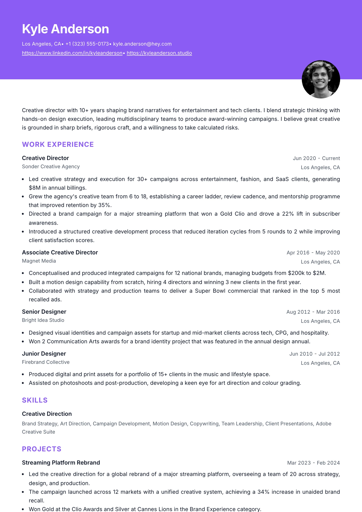
      <br /><sub><b>Banner</b></sub>
    </td>
    <td align="center">
      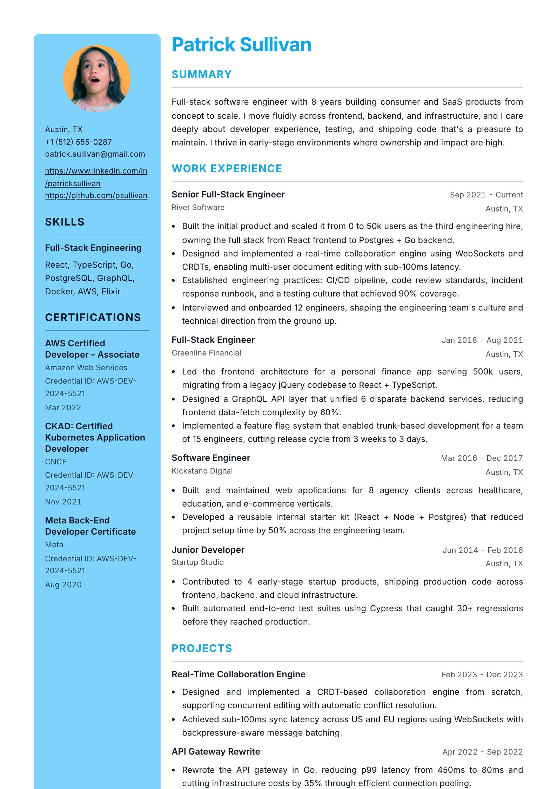
      <br /><sub><b>Split</b></sub>
    </td>
  </tr>
  <tr>
    <td align="center">
      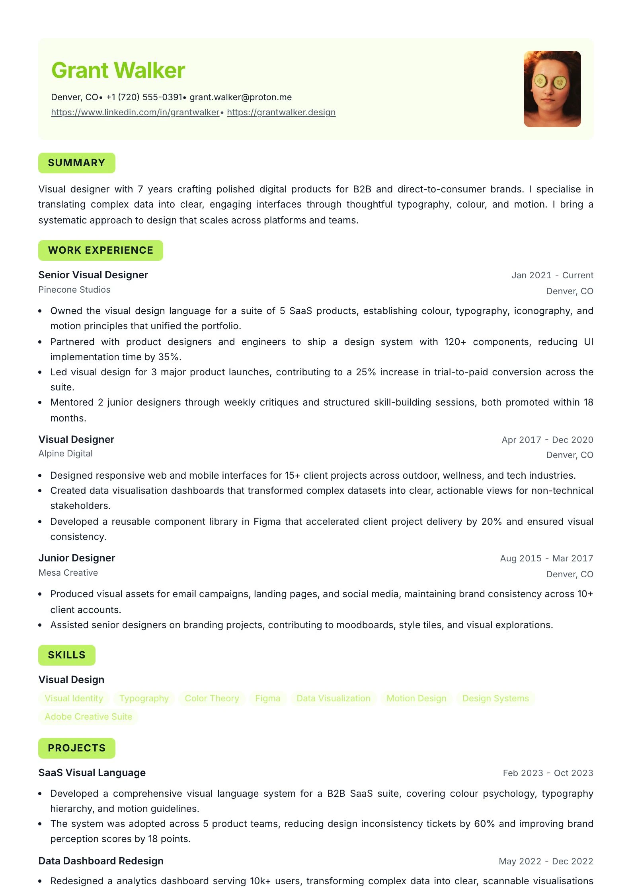
      <br /><sub><b>Tinted</b></sub>
    </td>
    <td align="center">
      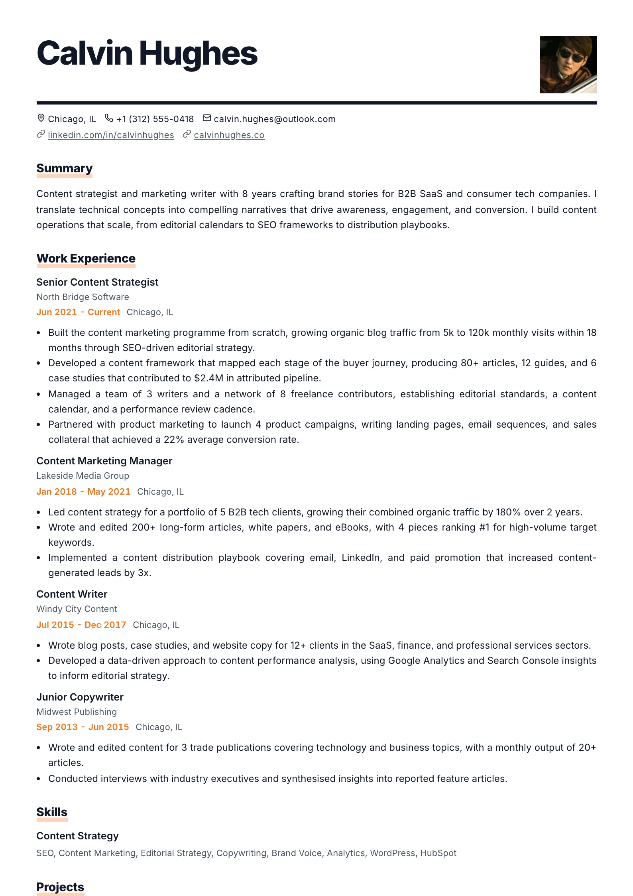
      <br /><sub><b>Bold Type</b></sub>
    </td>
    <td align="center">
      <!-- empty cell to align -->
    </td>
  </tr>
</table>

## Quick Start

The quickest way to run Resummme locally:

```bash
# Clone the repository
git clone https://github.com/angkasa27/resummme.git
cd resummme

# Install dependencies
pnpm install

# Setup environment variables
cp .env.example .env.local

# Start development server
pnpm dev
```

Open [http://localhost:3000](http://localhost:3000) to see the application.

## Tech Stack

| Category | Technology |
| --- | --- |
| Framework | Next.js 16 (App Router) |
| Runtime | Node.js 20+ |
| Language | TypeScript |
| Styling | Tailwind CSS 4 |
| UI Primitives | React 19, Base UI |
| Rich Text | TipTap |
| State Management | Zustand |
| PDF Export | Puppeteer (local) / Cloudflare Browser Run (prod) |
| AI | Google Gemini API (gemini-2.0-flash) |
| Forms | React Hook Form + Zod |
| Testing | Vitest + Testing Library |

## Available Scripts

```bash
pnpm dev          # Start the development server
pnpm build        # Build for production
pnpm start        # Start the production server
pnpm lint         # Run ESLint
pnpm test         # Run Vitest (single pass)
pnpm test:watch   # Run Vitest in watch mode
pnpm typecheck    # Type-check with tsc
```

## Environment Variables

Create a `.env.local` from the template:

```bash
cp .env.example .env.local
```

### AI features — Google Gemini

Powers "Extract from PDF", "Improve with AI", and "Analyze job description".

```bash
GEMINI_API_KEY=                  # https://aistudio.google.com/
GEMINI_MODEL=gemini-2.0-flash    # Optional model override
```

Without a key, the AI buttons are visible but calls will return a 503 error.

### PDF export

```bash
# "auto" (default) | "puppeteer" | "cloudflare-browser-run"
PDF_EXPORT_PROVIDER=auto
```

`auto` uses local Puppeteer in development. For production with Cloudflare Browser Run:

```bash
CLOUDFLARE_ACCOUNT_ID=
CLOUDFLARE_BROWSER_RUN_API_TOKEN=
CLOUDFLARE_BROWSER_RUN_KEEP_ALIVE_MS=60000
```

### Security

```bash
# Comma-separated origins allowed to call /api/export-pdf cross-origin.
# Same-origin requests are always allowed without this.
PDF_EXPORT_TRUSTED_ORIGINS=https://example.com
```

## Project Structure

```text
src/
  app/                         # Next.js route entrypoints and API handlers
  components/ui/               # Shared UI primitives (Button, Dialog, Select…)
  hooks/                       # App-level React hooks
  lib/                         # Utilities (cn, etc.)
  test/                        # Vitest setup
  features/resume-editor/
    canvas/                    # Control panel (Style tab, Insights tab, canvas forms)
      controls/                # Color picker, font picker, extract-CV dialog, ATS insights
      forms/                   # Canvas-mode section editors (dialog-based)
    domain/
      insights/                # ATS scoring, keyword matching, text extraction
      presentation/            # Resolvers, fonts, margins
      rich-text/               # Sanitizers
      schema/                  # Zod schemas for resume draft
      sections/                # Section config & metadata
    editor/                    # Sidebar form editor
      rich-text/               # TipTap + AI Dialog
      sections/                # Section form fields
    forms/                     # Shared form helpers
    preview/                   # Live PDF preview and CSS templates
      templates/               # classic | sidebar | modern-centered | compact | academic
    server/                    # Server-side PDF export & Gemini helpers
    state/                     # Zustand store
```

## How It Works

- **Editor** (`/`) — Split-panel layout: form editor left, live canvas preview center, Style/Insights panel right.
- **PDF render target** (`/resume-pdf`) — A plain page that Puppeteer opens to capture the PDF. Receives draft + presentation settings via base64-encoded query params.
- **PDF export** — `POST /api/export-pdf` → Puppeteer/Cloudflare Browser Run → streamed PDF response.
- **AI PDF import** — `POST /api/import-pdf` → extracts text → Gemini → structured draft JSON.
- **AI writing** — `POST /api/improve-content` → current field HTML + instructions → Gemini → sanitized HTML.
- **ATS job match** — `POST /api/insights/match-keywords` → job description → Gemini keyword list → client matches against current draft.

## Star History

<a href="https://star-history.com/#angkasa27/resummme&date">
  <picture>
    <source media="(prefers-color-scheme: dark)" srcset="https://api.star-history.com/svg?repos=angkasa27/resummme&type=date&theme=dark" />
    <source media="(prefers-color-scheme: light)" srcset="https://api.star-history.com/svg?repos=angkasa27/resummme&type=date" />
    
  </picture>
</a>

## Contributing

Contributions make open-source thrive. Whether fixing a typo or adding a feature, all contributions are welcome.

1. Fork the repository
2. Create a feature branch (`git checkout -b feature/amazing-feature`)
3. Commit your changes (`git commit -m 'Add amazing feature'`)
4. Push to the branch (`git push origin feature/amazing-feature`)
5. Open a Pull Request

Please read [CONTRIBUTING.md](CONTRIBUTING.md) before opening a pull request.

## License

Licensed under the [GNU Affero General Public License v3](LICENSE).
