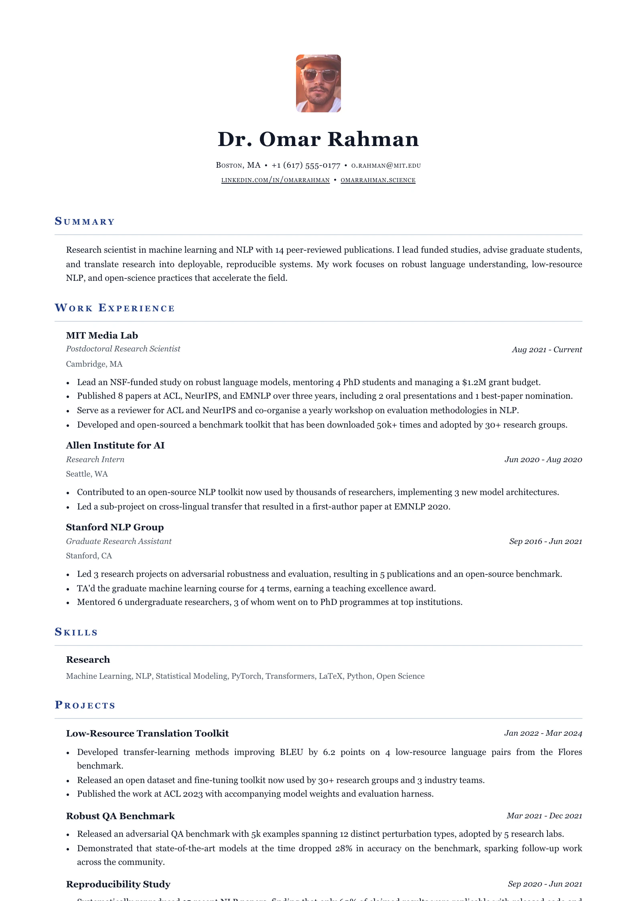
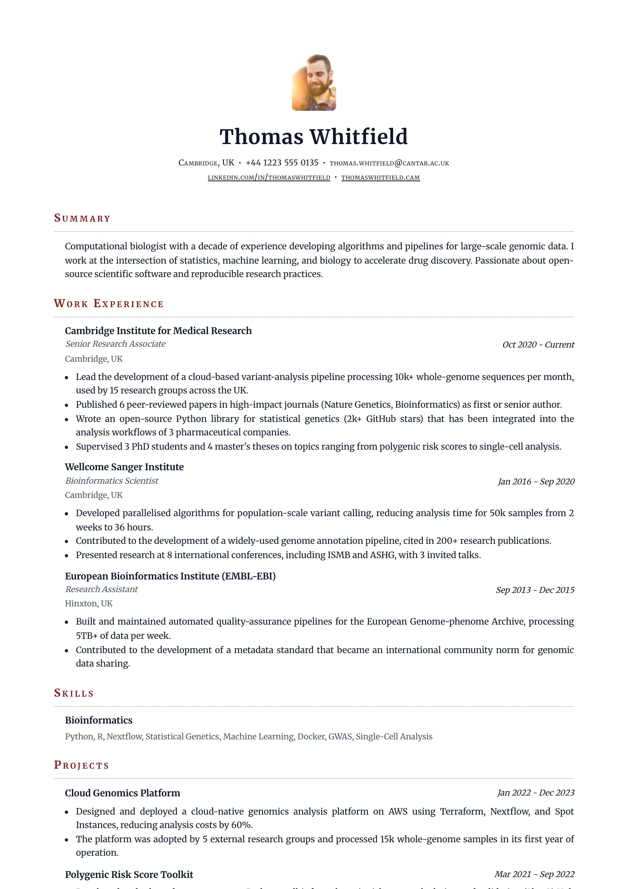

# Academic — `academic`

## Preview

| Academic Oxford | Academic Burgundy | Academic Journal |
| --- | --- | --- |
|  |  |  |

A CV, not a resume. The name is centred and set in the text colour rather than the
accent, section headings are **small caps** with wide tracking over a hairline
rule, dates are italic, and every section body is indented under its flush-left
heading the way an academic CV does. Prose is justified.

## What you would see

- **Page shape** — one column, centred header, everything else flush left with indented bodies.
- **Header** — vertical stack, centred: photo, name, headline, contacts. `--resume-gap-section` of padding under it.
- **Name** — `--resume-text`, weight 600, tracked `0.03em`. Understated.
- **Headline** — *italic*, regular weight, text colour.
- **Contacts** — `font-variant: small-caps`, tracked `0.04em`.
- **Section headings** — `font-variant: small-caps`, **not** uppercase, tracked `0.16em`, weight 600, over a `1px --resume-border` rule.
- **Bodies** — item lists *and* the summary indent by `--resume-indent`, so the heading hangs left of its content.
- **Dates** — *italic*, in `--resume-text` (not muted): in a CV the date is part of the item, not metadata.
- **Prose** — `text-align: justify`.
- **Photo** — 68px, `56 / 72` portrait, 6px corners, centred.
- **Link cue** — **dotted** underline at `0.2em`. A solid rule reads as heavy as the heading border at small-caps size.

## Wiring

`createSingleColumnLayout` · own `academicItemViews` (they add `.italic` role
labels) · own `header.tsx`.

## Careful

The stylesheet deliberately **does not set `--resume-font`.** Pinning a serif here
would override the user's font choice in the Style tab. The serif is the
*preset's* job — see the academic presets in `template-presets.ts`. Don't "fix"
this by adding a `font-family`.

## ATS

Rated `pass`. One column. Centred header, small-caps headings over hairlines, bodies indented under them. The indent and small caps are styling only; the text order is the same as Harvard's.
