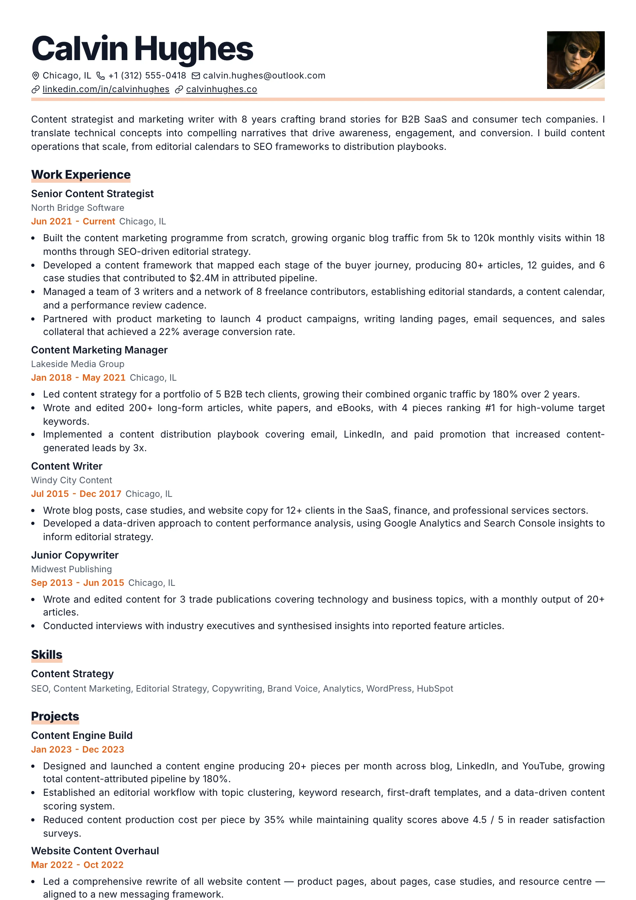
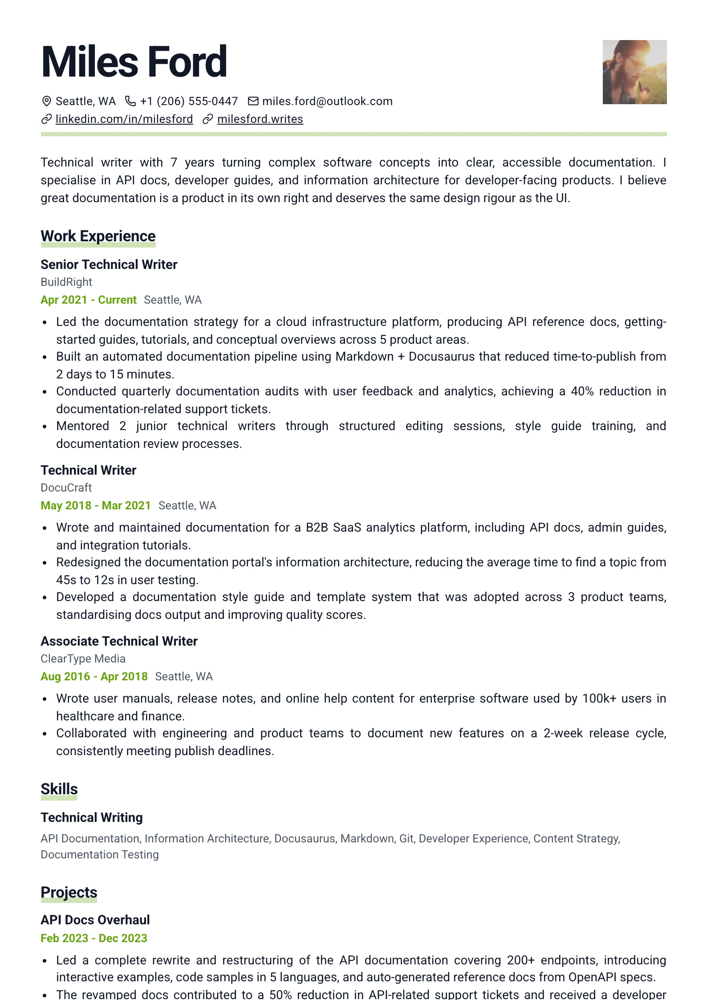

# Bold Type — `bold-type`

## Preview

| Bold Citrus | Bold Lime |
| --- | --- |
|  |  |

Editorial and loud. The name runs at one and a half times the normal h1 at weight
800 with tight negative tracking, and both the name and every section heading sit
on a **highlighter band** — a translucent accent swipe drawn with an inset
`box-shadow` behind the text. Nothing on the page is right-aligned; dates drop
under their titles in the accent colour.

## What you would see

- **Page shape** — one column with section gaps at `1.3×` the normal step. Airy.
- **Name** — `1.5 × h1`, weight 800, tracking `-0.04em`, line-height 1.02, `--resume-text`, with a `0.18em` marker band (accent at 30%) behind its lower third. `align-self: flex-start` so the band stops at the text.
- **Header layout** — `.header-top` is a flex row, `space-between`: name/headline/contacts on the left, a **square** 100px photo (radius 0) on the right.
- **Headline** — `0.44 × h1`, uppercase, tracked `0.1em`, weight 700. Anything lighter gets swallowed by the name.
- **Section headings** — **sentence case**, weight 800, tracking `-0.01em`, in `--resume-text` (the layout sets `--resume-heading-color` to text), with a thicker `0.35em` marker band behind them.
- **Dates** — weight 600 in `--resume-accent`, left-aligned, on a row beneath the title alongside the meta.
- **Alignment** — `.item-row` and `.item-header-side` both run left; the layout has no right margin content at all.
- **Link cue** — a solid `--resume-accent` underline at `0.18em`: it echoes the highlighter at 1px while the heading keeps the filled block.

## Wiring

`createSingleColumnLayout` · own `boldTypeItemViews` · own `header.tsx` (it emits
the `.header-top` row).

## Careful

Both marker bands are `box-shadow: inset`, not a background — that's what keeps
them tight to the text rather than filling the block. They paint, so both
`print-color-adjust` properties are required. The name's band is deliberately
thinner (`0.18em` vs `0.35em`) because it sits on much larger type.

## ATS

Rated `pass`. One column. The highlighter bands under the name and headings are inset box-shadows, not glyphs, so they add nothing to the extracted text.
