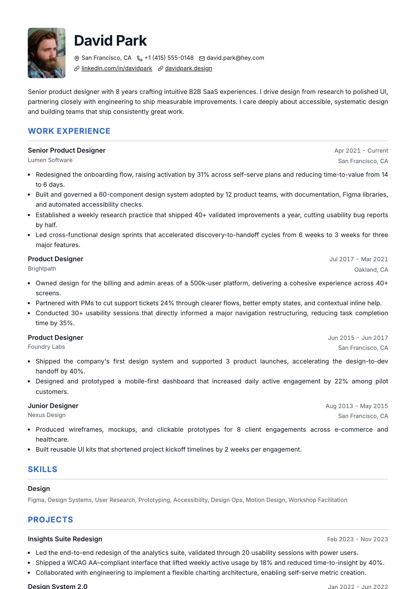
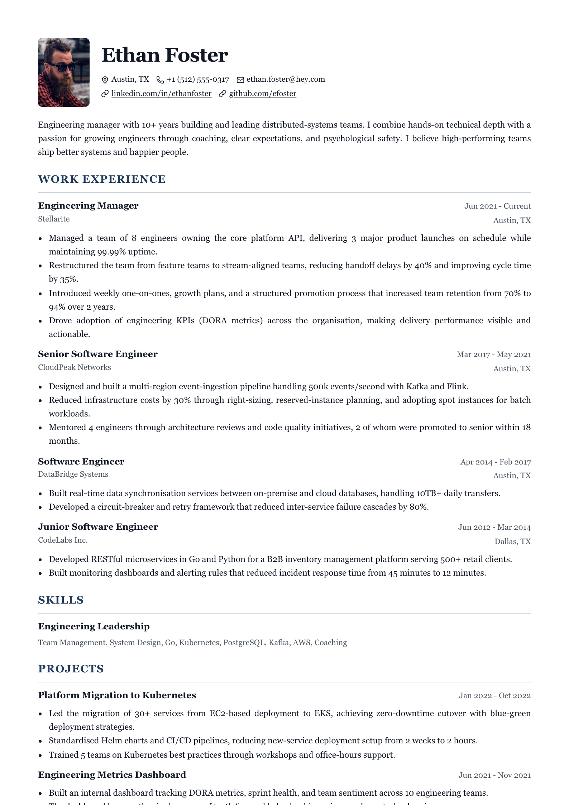

# Classic — `classic`

## Preview

| Classic Modern | Classic Executive | Classic Ats |
| --- | --- | --- |
|  |  |  |

The plain baseline, and the one every other layout is a departure from. A single
column with a small photo to the left of the name, and section headings set in
the accent colour, uppercase, each sitting on a hairline rule that runs the full
measure. Nothing is coloured, filled, or tinted anywhere else on the page.

## What you would see

- **Page shape** — one column, no rails or bands. Standard page margin on all four sides.
- **Header** — photo on the left, then a stacked block: name, headline, contact line. Vertically centred against the photo.
- **Name** — `--resume-text`, *not* the accent. The accent is reserved for the headings.
- **Headline** — regular weight, no caps, no tracking. Deliberately quiet.
- **Section headings** — accent, uppercase, tracked, with a `1px --resume-border` bottom rule and `--resume-gap-inner` of padding above it.
- **Items** — all shared defaults: title left, date flush right, meta under the title.
- **Photo** — 72px wide, `72 / 96` portrait, 6px corners.
- **Link cue** — plain underline at `0.16em`. The heading already carries its own rule, so links stay ordinary.

## Wiring

`createSingleColumnLayout` · `defaultItemViews` · header from `createPhotoHeader`.
There is no bespoke item DOM and no `renderSection` — everything comes from the
shared kit, which is the point of this layout.

## Careful

This is the ATS-safe reference. If you are tempted to add a fill, a badge, or a
counter here, you probably want a different layout — the gallery has eighteen
others. Changes here also ripple: `classic-modern` is the stock default preset,
so a regression shows up on a fresh resume before anything else.

## ATS

Rated `pass`. One column, top to bottom: photo-left header, the summary (no heading — `hideSummaryHeading`), then ruled uppercase sections. Nothing sits beside anything else. This is the reference for what `pass` means.
