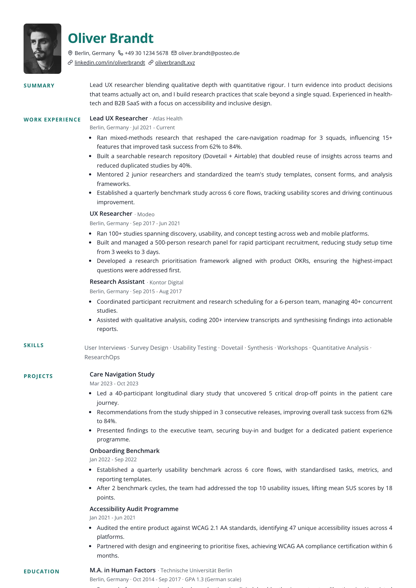
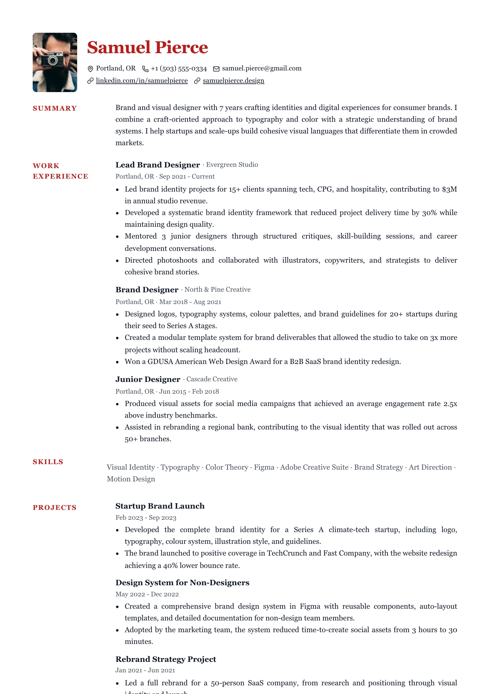

# Inset — `inset`

## Preview

| Inset Steel | Inset Crimson |
| --- | --- |
|  |  |

A margin-note layout. Each section is a grid whose left 110px track holds only the
heading — small, tracked, sitting at the top — while all the content lives in the
right track, indented a further notch so the label reads as a note in the margin
rather than a column header. The header uses the same two tracks, putting the
photo in the label rail and the name where the content starts.

## What you would see

- **Page shape** — one column visually, but `.section` and `.header` are both `110px | 1fr` grids sharing an alignment.
- **Section headings** — `--resume-meta` size (smaller than body), tracked `0.1em`, 2px of top padding, wrapping allowed (`overflow-wrap: anywhere`) since 110px is tight.
- **Bodies** — item lists, the summary, and the merged skills line all get `padding-left: --resume-indent`, so they sit off the rail's edge.
- **Items** — two rows. Row 1 is **inline** flow, not flex: title and meta run together and wrap where the text does. Row 2 is a wrapping flex row of small muted fields at `0.9em`, separated by `.separator` glyphs in the border colour.
- **Skills** — collapsed into a single line joined by `·`, via a `renderSection` override in `layout.tsx`. This is the one layout that rewrites a section node.
- **Header** — photo pinned to grid column 1 at 72px (`72 / 96`, 6px corners); name, headline, contacts in column 2 with the same `--resume-indent` so the name lines up with every line below it.
- **Headline** — `0.4 × h1`, uppercase, tracked `0.08em`, weight 600 — tracked like the label gutter beneath it.
- **Link cue** — plain underline; the accent gutter labels carry the hierarchy.

## Wiring

`createSingleColumnLayout` with a `renderSection` override · own `insetItemViews`
· own `header.tsx`.

## Careful

Row 1 is `display: block` with inline children for a reason: as flex items the
title and meta were atomic, so a long meta moved as a unit and the line broke
*before* the separator. The separator binds to its neighbour with a no-break space
in `items.tsx`. Both grids declare their columns explicitly so a photo-less resume
keeps the alignment.

## ATS

Rated `pass`. Headings sit in a 110px label rail left of their body. A heading is one or two words and lands level with the body's first line, so reading across gives "heading, first line". Skills merge into one line joined by " · ".
