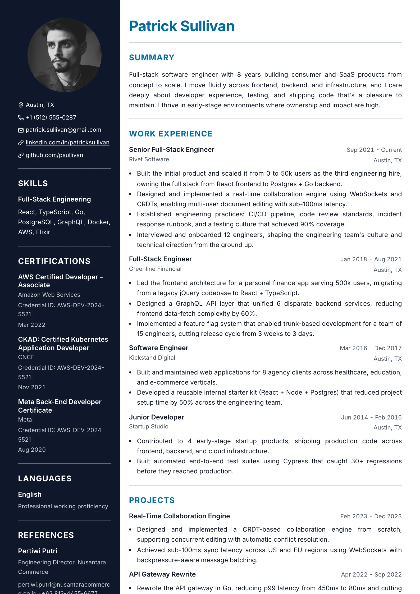
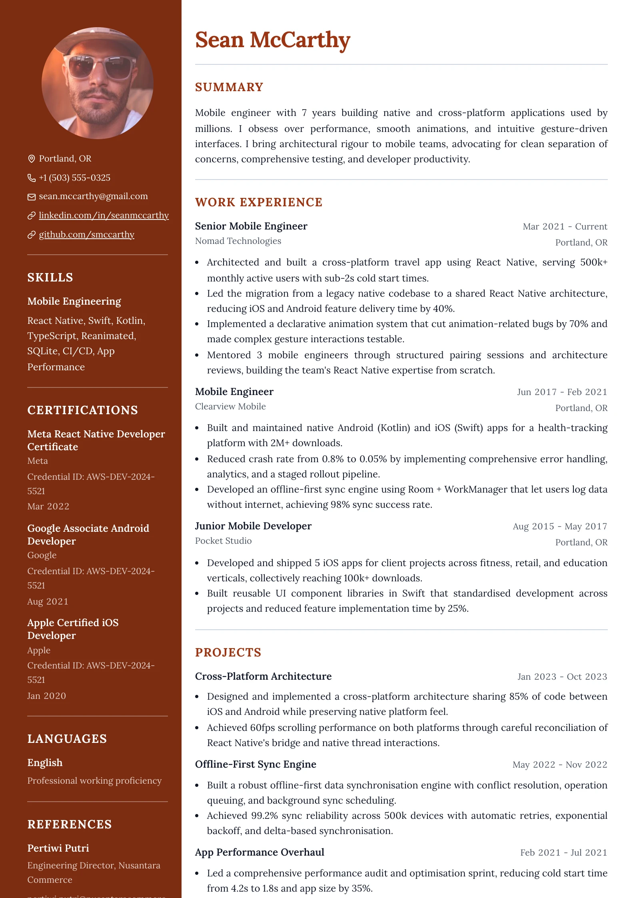

# Split — `split`

## Preview

| Split Midnight | Split Terracotta |
| --- | --- |
|  |  |

A full-height coloured rail down the **left** third of the page, painted in
`--resume-secondary`, carrying a large round photo, the contacts stacked one per
line with icons, and the short sections (skills, languages, certifications,
references). The wider right column holds the name, the summary, and the career
history on plain white.

## What you would see

- **Page shape** — `0.4fr | 1fr` grid, no gap. Full-bleed: the rail paints to the left, top and bottom paper edges.
- **The rail** — `--resume-secondary` background with `--resume-on-secondary` text. It locally reassigns `--resume-text`, `--resume-muted` (78% of on-secondary) and `--resume-border` (35%), so everything inside recolours automatically.
- **Rail contents, in order** — photo, stacked iconic contacts, then the side sections.
- **Photo** — 140px tall, circular by default, centred in the rail.
- **Insets** — the rail's bleeding edges take the full page margin; its inner edge takes `--resume-gutter` (half the margin), and the main column takes the same on its side, so both contribute equally to the channel between them.
- **Section headings** — in *both* columns, a `1px` **top** border with `--resume-gap-section` of padding under it. The rule sits above the heading, not below.
- **Name** — `--resume-accent`, in the main column.
- **Summary** — heading suppressed (`hideSummaryHeading`), so it reads as a lede under the name.
- **Rail typography** — item headers, item rows and dates all stack and left-align, because a title-and-date row doesn't fit a 0.4fr column.
- **Link cue** — a **45%-opacity** underline. A full-strength rule buzzes against the coloured rail, and the heading's top hairline has to stay the stronger line.

## Wiring

Own `Component` · `splitItemViews` · `getColumn: getSideRailColumn` (shared with
`duet`, `ledger`, `dossier`, `compass`) · `hideSummaryHeading: true`.

## Careful

The rail's background paints, so it carries both `print-color-adjust` properties —
without them the PDF exports a white rail with white text. `duet` imports
`splitItemViews`, so a change to those item views changes two layouts.

## ATS

Rated `fail`. A full-height rail on the left (photo, contacts, skills, certifications, languages) beside the main column (`getColumn`). A parser reading across mixes the rail into the history.
