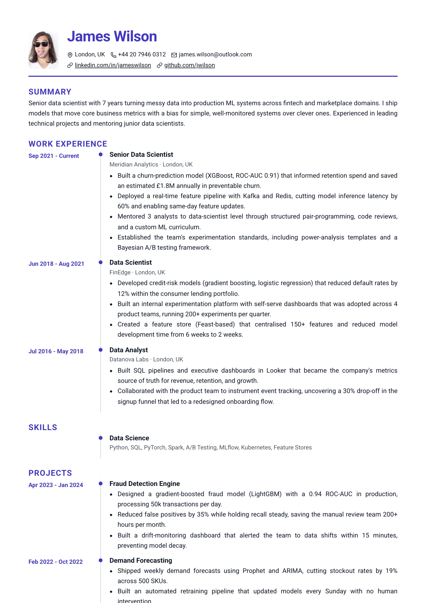
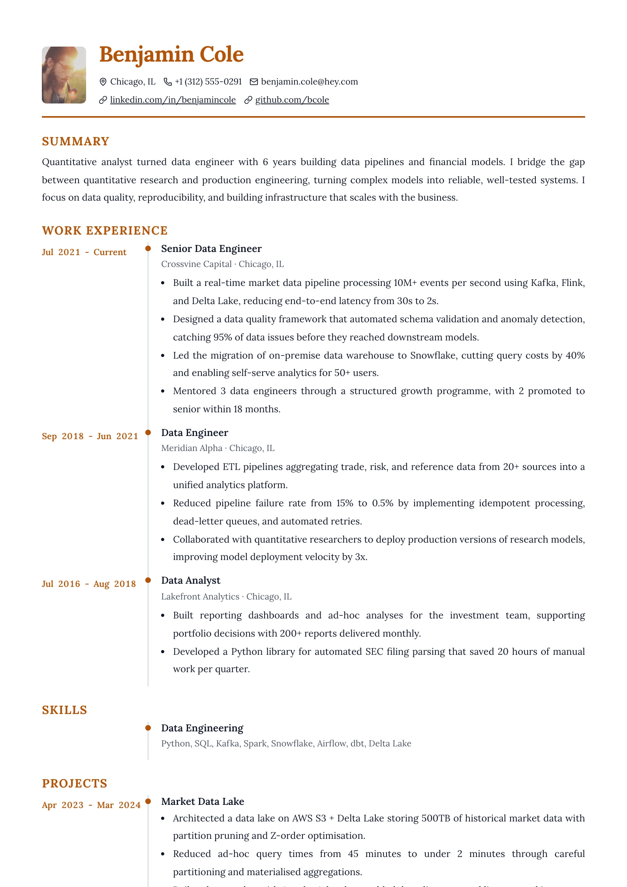

# Timeline — `timeline`

## Preview

| Timeline Indigo | Timeline Amber |
| --- | --- |
|  |  |

A chronology. Every item is a two-column row: the dates sit in a fixed 128px
column on the left in the accent colour, and the content sits on the right behind
a continuous vertical hairline with a small filled accent dot beside each item
title. Because the section and item gaps are zeroed, that hairline runs unbroken
down the whole page like a spine.

## What you would see

- **Page shape** — one column, but every item is internally a `128px | 1fr` grid.
- **Header** — photo left, name and contacts stacked right, the whole block sitting on a **2px accent** bottom rule.
- **The rail** — `1.5px solid --resume-border` on the left edge of every item's content, with `--resume-gap-item + 6px` of padding after it.
- **The dot** — a 7px accent circle, `border-radius: 50%`, positioned at `left: -4.25px; top: 4px` so it straddles the rail beside each title.
- **Dates** — weight 600 in `--resume-accent`, wrapping is allowed but each "Month Year" is kept intact (`.date-part` is `nowrap`); only the range breaks at its separator.
- **Section headings** — the shared default (accent, uppercase, tracked). No rule of their own; the spine is the ornament.
- **Photo** — 76px, `56 / 72` portrait, 6px corners.
- **Link cue** — plain underline. Accent is already spent on the dots, the dates and the headings; colouring links too would muddy the spine.

## Wiring

`createSingleColumnLayout` · own `timelineItemViews` (they emit `.timeline-item`,
`.timeline-date`, `.item-content`) · own `header.tsx`.

## Careful

`.section` and `.item-list` are both `gap: 0` on purpose — the vertical rhythm
comes from each item's own `padding-bottom`. Reintroducing a gap breaks the rail
into dashes. The dot paints, so it needs both `print-color-adjust` properties.

## ATS

Rated `pass`. Each item is a 128px date column beside its content. The date is one short line, so reading across gives "date, title". The rail and the dots are borders, not text.
